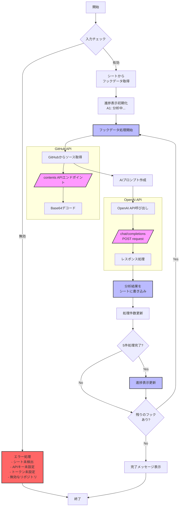

# AIによるWordPressフック解析仕様

## 概要
`analyzeHooksWithAI()`は、既に抽出されたWordPressフックの情報をOpenAI APIを使用して詳細に分析し、各フックの役割や機能を自然言語で説明する機能です。

## 前提条件

### 必要なシート
- シート名: 「Hook List」
- 必要な列:
  1. ファイルパス (A列)
  2. クラス名 (B列)
  3. フック名 (C列)
  4. コールバック関数名 (D列)
  5. フック種別 (E列)
  - 分析結果は7列目(G列)に出力

### 必要な認証情報
1. **OpenAI APIキー**
   - スクリプトプロパティ名: `OPENAI_API_KEY`
   - 形式: `sk-` で始まる文字列

2. **GitHub トークン**
   - スクリプトプロパティ名: `GITHUB_TOKEN`
   - 用途: ソースコード取得用

### リポジトリ情報
- 形式: `オーナー名/リポジトリ名`
- 例: `wordpress/wordpress`

## 詳細フロー図



## API呼び出し詳細

### 1. GitHub API
- **エンドポイント**: `https://api.github.com/repos/{owner}/{repo}/contents/{path}`
- **メソッド**: GET
- **ヘッダー**:
  ```javascript
  {
    'Authorization': `token ${GITHUB_TOKEN}`,
    'Accept': 'application/vnd.github.v3+json'
  }
  ```
- **レスポンス処理**:
  - Base64エンコードされたコンテンツをデコード
  - ファイルの内容を文字列として取得

### 2. OpenAI API
- **エンドポイント**: `https://api.openai.com/v1/chat/completions`
- **メソッド**: POST
- **ヘッダー**:
  ```javascript
  {
    'Authorization': `Bearer ${OPENAI_API_KEY}`,
    'Content-Type': 'application/json'
  }
  ```
- **リクエストボディ**:
  ```javascript
  {
    model: "gpt-3.5-turbo",
    messages: [
      {
        role: "system",
        content: "あなたはWordPressの開発者アシスタントです..."
      },
      {
        role: "user",
        content: prompt // 分析用プロンプト
      }
    ],
    temperature: 0.3,
    max_tokens: 150
  }
  ```
- **レスポンス処理**:
  - JSONレスポンスから分析結果を抽出
  - シートの該当セルに書き込み

### データフロー制御
1. **バッチ処理**:
   - 5件ごとに進捗更新
   - スプレッドシートの更新を最適化

2. **エラーハンドリング**:
   - API制限エラー
   - ネットワークエラー
   - 無効なレスポンス

3. **リソース管理**:
   - APIリクエストの間隔制御
   - メモリ使用量の最適化

## AIプロンプト仕様

### 入力情報
```
WordPressのフックの役割を分析してください：

フック種別: [action/filter]
フック名: [フック名]
クラス名: [クラス名]
コールバック: [コールバック関数名]

ソースコード:
[ファイルの全内容]

分析ポイント：
1. フックの主な目的
2. 処理内容
3. 実行タイミング
4. 関連する機能
```

### AIモデル設定
- モデル: gpt-3.5-turbo
- 最大トークン: 150
- temperature: 0.3

## エラーハンドリング

### 表示されるエラーメッセージ
1. シート未検出
   ```
   エラー: 「Hook List」シートが見つかりません。先にフックを検索してください。
   ```

2. APIキー未設定
   ```
   設定エラー: OpenAI APIキーが設定されていません。
   1. スクリプトエディタを開く
   2. プロジェクトの設定を開く
   3. スクリプトプロパティに'OPENAI_API_KEY'を追加
   4. APIキーを入力して保存
   ```

3. GitHubトークン未設定
   ```
   エラー: GitHub トークンが設定されていません。先にGitHubトークンを設定してください。
   ```

4. リポジトリ形式エラー
   ```
   エラー: リポジトリの形式が正しくありません。'オーナー名/リポジトリ名'の形式で指定してください。
   ```

### エラーログ
- エラー発生時はLogger.logに詳細を記録
- シートのA1セルにエラーメッセージを表示

## 進捗表示

### 処理状況
1. 開始時
   ```
   AIによる分析中...
   ```

2. 処理中（5件ごと）
   ```
   分析中... [現在の件数]/[全件数]
   ```

3. 完了時
   ```
   分析完了: [総件数]件のフックを分析しました
   ```

## パフォーマンス考慮事項
- 大量のフックがある場合、処理時間が長くなる
- OpenAI APIの利用料金が発生
- GitHubのAPI制限に注意
- 5件ごとにスプレッドシートの更新を行う

## 制限事項
- 一度に処理できるフック数に制限なし
- ソースコードが大きすぎる場合、APIの制限に抵触する可能性あり
- 分析結果は参考情報として扱うべき 