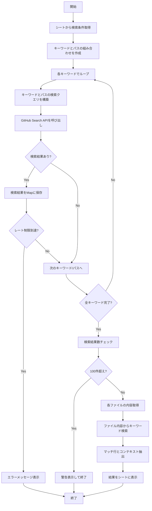

# GitHub検索ツール

## 関数概要

`gitHub_Search()`は、指定されたGitHubリポジトリ内で特定のキーワードを検索し、結果をスプレッドシートに表示する関数です。複数のキーワードと複数のファイルパスを組み合わせた詳細な検索が可能で、検索結果のコードスニペットも表示します。

## 使い方

1. **シートの準備**
   - 「GitHub Search」という名前のシートを作成
   - A列：検索キーワード（3行目以降に入力）
   - B列：検索パス（3行目以降に入力、オプション）

2. **GitHub トークンの設定**
   - スクリプトエディタで[ファイル] > [プロジェクトのプロパティ] > [スクリプトのプロパティ]を開く
   - プロパティ名「GITHUB_TOKEN」を追加し、値にGitHubトークンを設定

3. **検索の実行**
   - 関数を実行すると、指定されたリポジトリ内で検索を実行
   - 結果は「GitHub Search」シートのC列以降に表示

## 使用しているGitHub API

1. **Search Code API**
   - エンドポイント: `https://api.github.com/search/code`
   - 用途: キーワードやパスに一致するファイルを検索
   - パラメータ: `q` (検索クエリ), `per_page` (結果数), `page` (ページ番号)

2. **Contents API**
   - エンドポイント: `https://api.github.com/repos/{owner}/{repo}/contents/{path}`
   - 用途: 検索でヒットしたファイルの内容を取得
   - パラメータ: リポジトリ所有者、リポジトリ名、ファイルパス

## トークン要件

- **必要な権限**: `repo` (プライベートリポジトリを検索する場合)
- **レート制限**: 認証済みユーザーは1時間あたり30リクエスト（Search API）
- **取得方法**: 
  1. GitHubにログイン → Settings → Developer settings → Personal access tokens → Generate new token
  2. 適切な権限を選択してトークンを生成
  3. 生成されたトークンをスクリプトプロパティに設定

## 注意事項

- 検索結果が100ファイルを超える場合は処理を中止します
- GitHubのAPIレート制限に達する可能性があるため、短時間に多数の検索を行わないでください
- 大量のキーワードやパスを指定すると、処理時間が長くなります
- バイナリファイル（.exe、.png、.jpgなど）は内容検索の対象外となりますが、コードファイル（.ts、.js、.py）や設定ファイル（.yml、.json）、マークダウン（.md）などのテキストベースのファイルは検索対象となります
## 処理フロー

