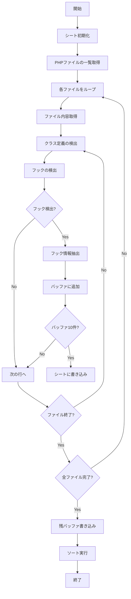

# WordPress フック解析ツール

## 関数概要

`fetchHooksFromGitHub()`は、指定されたGitHubリポジトリ内のWordPressプラグインやテーマからフックを検索し、その使用状況を分析・一覧化する関数です。フック名、コールバック関数、クラスコンテキストを抽出し、オプションでAIによる役割分析も可能です。

## 使い方

1. **シートの準備**
   - 「Hook List」という名前のシートを作成
   - 自動的に以下の列が作成されます：
     - ファイル名
     - クラス名
     - フック名
     - コールバック関数名
     - 種別（action/filter）
     - 行番号（GitHubリンク付き）
     - 推定される役割

2. **GitHub トークンの設定**
   - スクリプトエディタで[ファイル] > [プロジェクトのプロパティ] > [スクリプトのプロパティ]を開く
   - プロパティ名「GITHUB_TOKEN」を追加し、値にGitHubトークンを設定

3. **OpenAI APIキーの設定（オプション）**
   - メニューから「OpenAI APIキーを設定」を選択
   - APIキーを入力（sk-で始まる文字列）
   - 設定状況は「APIキー設定を確認」で確認可能

4. **フック解析の実行**
   - メニューから「フックを検索」を選択
   - 必要に応じて「AIで役割を分析」を実行

## 使用しているAPI

1. **GitHub API**
   - Contents API: リポジトリ内のファイル一覧と内容の取得
   - 認証: Personal Access Token

2. **OpenAI API（オプション）**
   - モデル: GPT-3.5-turbo
   - 用途: フックの役割分析
   - 認証: OpenAI APIキー

## 処理フロー

## フック解析の仕様

### 抽出対象
- `add_action()` 呼び出し
- `add_filter()` 呼び出し
- クラス内のフック定義
- クラス外のフック定義

### 抽出情報
1. **ファイル情報**
   - ファイルパス
   - GitHubリンク（行番号付き）

2. **フック情報**
   - フック名（クォートで囲まれた文字列）
   - 種別（action/filter）
   - コールバック関数名

3. **コンテキスト情報**
   - 所属クラス名（存在する場合）
   - ファイル内の行番号

### AI分析（オプション）
- ソースコード全体の文脈を考慮
- フックの主な目的を分析
- 処理内容の要約
- 実行タイミングの特定
- 関連機能との連携分析

## 注意事項

- 検索対象は'inc'フォルダ以下のPHPファイル
- GitHubのAPIレート制限に注意
- AI分析時はOpenAI APIの利用料金が発生
- 大規模リポジトリの場合は処理時間が長くなる可能性あり
- フック検出は静的解析のため、動的に生成されるフック名は検出できない場合あり

## エラーハンドリング

- シート未作成時のエラー通知
- GitHub トークン未設定時のエラー通知
- OpenAI APIキー未設定時のガイダンス
- API制限到達時のエラー処理
- 無効なリポジトリ形式のチェック

## 今後の改善予定

- フック間の依存関係の可視化
- より詳細なコンテキスト分析
- カスタムフックの検出強化
- パフォーマンス最適化
- バッチ処理オプションの追加
