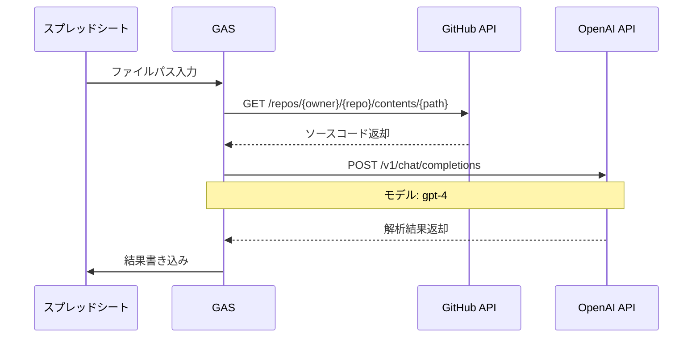

ソースコード解析システム仕様書
概要
GitHubのソースコードをAI（GPT-4）で解析し、仕様書を自動生成するシステム。
システムフロー

## API仕様

### GitHub API
エンドポイント: https://api.github.com/repos/${repo}/contents/${sourcePath}
メソッド: GET
ヘッダー:

### OpenAI API
エンドポイント: https://api.openai.com/v1/chat/completions
メソッド: POST
モデル: gpt-4
Temperature: 0
ヘッダー:

## スプレッドシート構造

A2: ソースファイルパス（GitHubリンク付き）
B2: 処理ステータス
B5: エラーメッセージ
5行目: 解析項目ヘッダー
6行目以降: 解析結果

## 主要機能
1. 単一ファイル解析 (analyzeSourceWithAI)
A2セルのパスのファイルを解析
GitHubからソース取得
AIで解析実行
結果を6行目以降に出力
   1. 複数ファイル解析 (analyzeMultipleFiles)
A列の2行目以降のファイルを順次解析
各ファイルごとに単一ファイル解析を実行
エラー発生時も次のファイルの処理を継続

## AIプロンプト仕様
### システムプロンプト
あなたはソースコードを解析して仕様書を作成する専門家です。
ファイルの種類に応じて適切な解析を行い、指定された項目の情報を抽出してください。

解析の基本方針：
1. ファイルの構造を上から順に解析
2. 指定された項目に関する情報を優先的に抽出
3. 階層構造や依存関係を考慮
4. コメントや関連情報も参考に
5. 数式やロジックは簡潔でわかりやすい日本語に変換

数式の説明方針：
- 複雑な計算式は「〜を計算」のような平易な表現に
- 条件分岐は「〜の場合」のような形で説明
- 技術的な用語は一般的な言葉に置き換える
- 具体例を用いて説明

## エラーハンドリング
GitHubアクセスエラー
トークン不正
ファイル未存在
API制限
OpenAIエラー
APIキー不正
レスポンスエラー
データ形式エラー
ヘッダー未設定
列数不一致

## 出力形式
行区切り: |||
列区切り: ###
ヘッダー行は除外
各列はヘッダーに対応する情報を格納