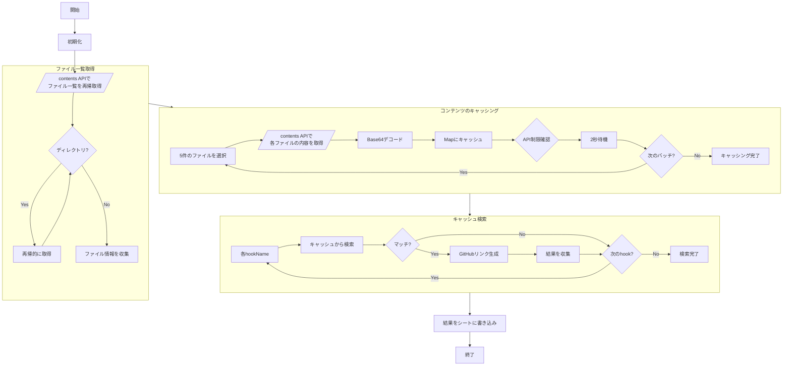

# Hook Usage Searcher 仕様書

## 概要
GitHubリポジトリ内のフック使用箇所を効率的に検索し、結果をスプレッドシートに表示するツール。

## 処理フロー

## GitHub API利用詳細

### 1. ファイル一覧取得 (/contents)
- エンドポイント: `GET /repos/{owner}/{repo}/contents/{path}`
- 用途: ディレクトリ構造の再帰的な取得
- レスポンス: ファイル/ディレクトリ情報の配列
- ヘッダー: `Accept: application/vnd.github.v3+json`

### 2. ファイル内容取得 (/contents)
- エンドポイント: `GET /repos/{owner}/{repo}/contents/{path}`
- 用途: 個別ファイルの内容取得
- レスポンス: Base64エンコードされたコンテンツ
- ヘッダー: `Accept: application/vnd.github.v3+json`

### API制限監視
- ヘッダー:
  - `x-ratelimit-remaining`: 残りリクエスト数
  - `x-ratelimit-reset`: リセット時刻（UNIX時間）
- 制限: 5,000 requests/hour (Core API)
- 待機: 2秒/バッチ（5ファイル）

## 主要コンポーネント

### 1. 初期化
- シート「Hook List」を取得
- H列をクリア
- hookNames配列を取得

### 2. ファイル一覧取得
- `listPhpFiles()`関数で再帰的にファイル一覧を取得
- 対象拡張子: .ts, .js, .vue
- 対象ディレクトリ: src/

### 3. ファイルコンテンツのキャッシング
- 5件ずつバッチ処理
- GitHub Contents APIを使用
- Map形式でキャッシュ
- API制限を考慮（2秒間隔）

### 4. フック検索処理
- キャッシュしたコンテンツから検索
- 各hookNameに対して全ファイルを検索
- マッチしたファイルのパスとURLを収集

### 5. 結果の書き込み
- RichTextValueを使用
- 複数マッチを改行区切りで1セルに格納
- クリック可能なハイパーリンク

## API使用量
- Contents API: ファイル数分
- Core API制限: 5,000 requests/hour
- 待機時間: 2秒/バッチ

## エラー処理
- API制限超過の監視
- 残りリクエスト数の表示
- リセット時刻の表示（JST）

## 表示形式
- H列: フック使用箇所
- 複数マッチ: 改行区切り
- 各ファイルパス: GitHubへのリンク

## パフォーマンス最適化
- ファイル内容の一括キャッシング
- バッチ処理による並列化
- 最小限のAPI呼び出し