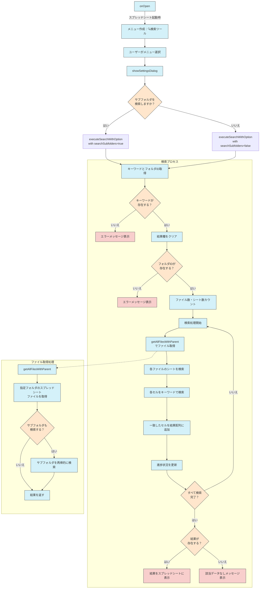

## プロセスの説明

### 1. 初期設定

- **onOpen**: スプレッドシート開始時に実行され、カスタムメニュー「🔍検索ツール」を作成します
- **showSettingsDialog**: ユーザーがサブフォルダも検索するか選択するダイアログを表示します

### 2. 検索プロセス

- **executeSearchWithOption**: メイン検索処理を実行します
  - キーワードとフォルダIDの検証
  - 検索対象のファイル数とシート数を計算
  - 各ファイルとシートに対して検索実行
  - 進捗状況の定期的な更新
  - 結果の表示

### 3. ファイル収集

- **getAllFilesWithParent**: 指定されたフォルダから検索対象のスプレッドシートを収集
  - 再帰的にサブフォルダも検索（オプション選択時）
  - 親フォルダ情報も保持

検索は複数のフォルダを横断して行われ、指定したキーワードを含むセルをすべて検出して結果を一覧表示します。