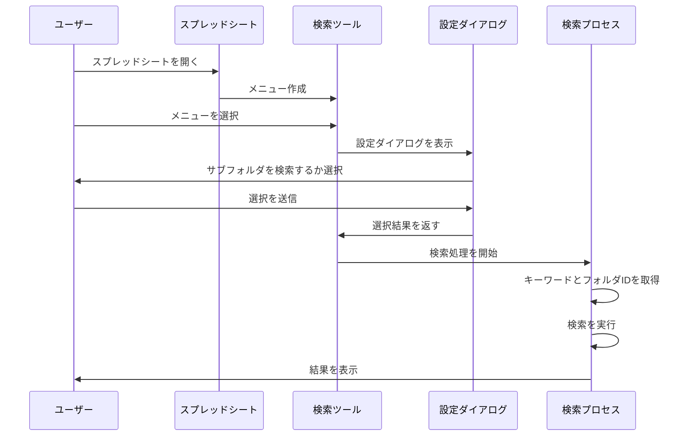

```mermaid
sequenceDiagram
    participant ユーザー
    participant スプレッドシート
    participant 検索ツール
    participant 設定ダイアログ
    participant 検索プロセス

    ユーザー->>スプレッドシート: スプレッドシートを開く
    スプレッドシート->>検索ツール: メニュー作成
    ユーザー->>検索ツール: メニューを選択
    検索ツール->>設定ダイアログ: 設定ダイアログを表示
    設定ダイアログ->>ユーザー: サブフォルダを検索するか選択
    ユーザー->>設定ダイアログ: 選択を送信
    設定ダイアログ->>検索ツール: 選択結果を返す
    検索ツール->>検索プロセス: 検索処理を開始
    検索プロセス->>検索プロセス: キーワードとフォルダIDを取得
    検索プロセス->>検索プロセス: 検索を実行
    検索プロセス->>ユーザー: 結果を表示
``` 