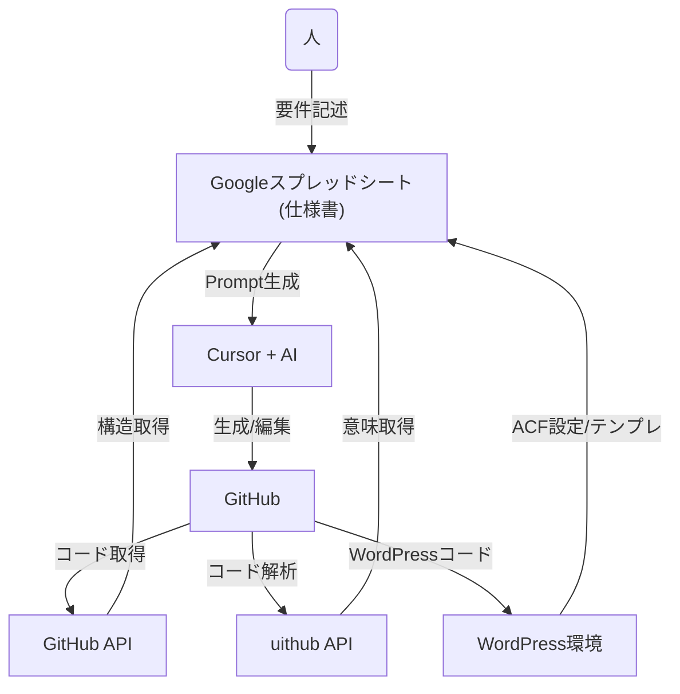

# コードと仕様書の双方向同期フロー

## 概要

非エンジニアの要件定義からスプレッドシートに仕様を記述し、それをもとにAIがコードを生成。コードはGitHubに管理され、GitHub APIやuithub APIを使って構造・意味情報を取得し、再び仕様書に反映する。

## フロー図（Mermaid）

```mermaid
flowchart TD
    A("人") -->|要件記述| B["Googleスプレッドシート<br>(仕様書)"]
    B -->|Prompt生成| C[Cursor + AI]
    C -->|生成/編集| F[GitHub]
    F -->|コード取得| D[GitHub API]
    F -->|コード解析| E[uithub API]
    D -->|構造取得| B
    E -->|意味取得| B
    F -->|WordPressコード| G[WordPress環境]
    G -->|ACF設定/テンプレ| B
```